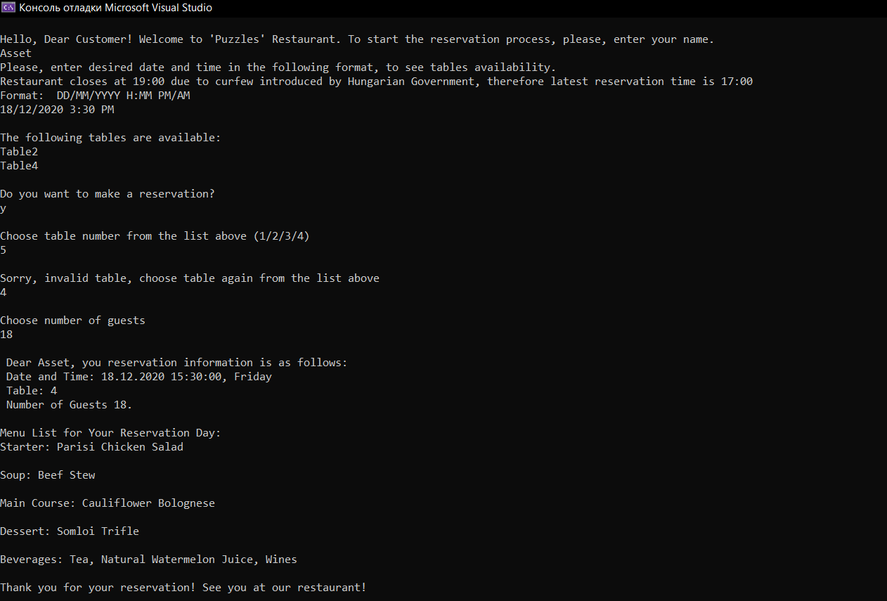

# Development of Software Applications Assignment

Home Work on Development of Software Applications Course

## Restaurant Management System

Design a .Net application by with a phone operator at a restaurant can manage table reservations:
- Can list available tables (depending on the time)
- Can assembly reservation by setting the time of the arrival, the number of guests, and name
of the person who books the table.
- Can list the daily menu

## Installation

For this purpose Microsoft Visual Studio with .Net extenction has been used

## Result

## UML Diagrams
## Use Case Diagram
## Class Diagram
## Sequence Diagrams

